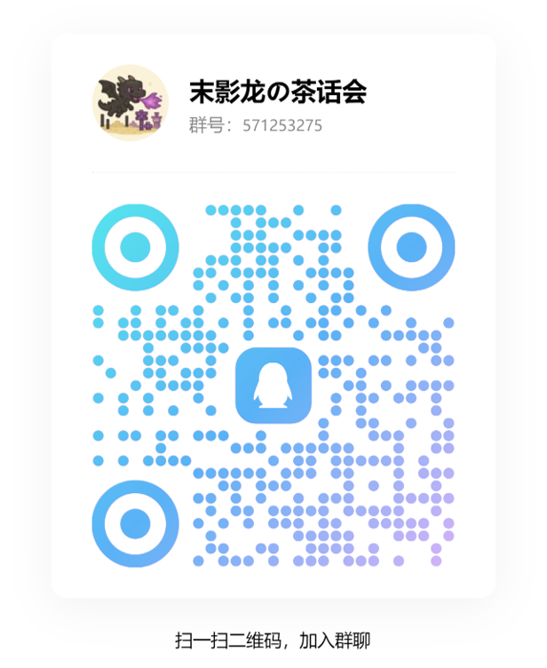

## 简介

欢迎来到“末影龙的茶话会”服务器！本指南汇总了入服前须知、行为规范、常用流程、处罚规则以及常见问题解答，旨在帮助新老玩家快速上手并维持良好社区体验。请在参与游戏前仔细阅读并遵守。祝你在这里玩得开心、交到朋友、留下美好回忆。

加入QQ交流群：`571253275`获取皮肤站注册邀请码以及服务器地址

## 服务器简介

- 服务器类型：原版（也许？）生存，生电/建筑/养老（？）
- 服务器版本：1.21.11（将随着mc版本更新）
- 重要说明：管理员会不定期开启活动、更新规则或执行维护，请关注公告频道以获取最新信息。

## 入服前准备
- 访问皮肤站 https://edtp.gbwater.icu/skin/ 注册账号（需要邀请码，加qq群获取）。推荐绑定正版角色
- 备份重要世界或个人数据：虽然服务器会做定期备份，但不保证可以恢复所有个人损失。
- 安装必要的客户端模组或插件
    - 推荐安装：`carpet-edtp-addition` [github](https://github.com/water2004/carpet_edtp_addition) [modrinth](https://modrinth.com/mod/carpet-edtp-addition)
    - 推荐安装：`chain_vein_fabric` [github](https://github.com/water2004/ChainVeinFabric) [modrinth](https://modrinth.com/mod/chainveinfabric)
    - 推荐安装：`TeleportCommandsFabric` [github](https://github.com/EasterGhost/TeleportCommandsFabric) [modrinth](https://modrinth.com/mod/teleportcommandsfabric)
    - **必须安装：**`better_update_suppression` [github](https://github.com/water2004/better_update_suppression) [modrinth](https://modrinth.com/mod/better-update-suppression)
 
## 基本行为规则（必读）

- **尊重与文明**：禁止人身攻击、辱骂、歧视、骚扰或其他不当行为。遇到争执优先寻求管理员介入。
- **禁止作弊**：严禁使用外挂、篡改客户端、破坏游戏平衡的第三方工具，一经查实将视情节给予处罚（警告、封禁等）。
- **禁止蓄意破坏**：不得恶意摧毁他人建筑、盗窃、破坏公共设施或故意影响他人游玩体验。
- **禁止广告与滥发链接**：不得在公共频道或聊天中发布未经允许的广告、邀请码或外部服务器邀请。

## 常用命令（示例）

- `/home` `/sethome`：家点传送相关（如服务器启用）。
- `/warps`：传送点

（注：具体命令请参见服务器帮助或公告板）

## 附加说明

- 管理员保留根据实际情况调整规则与执行细节的权利，重要变更会发布在公告中。
- 本指南非穷尽性文件，遇到未覆盖的问题请向管理员咨询。

---

感谢阅读本游玩须知，期待你在服务器里留下精彩的故事与回忆！

